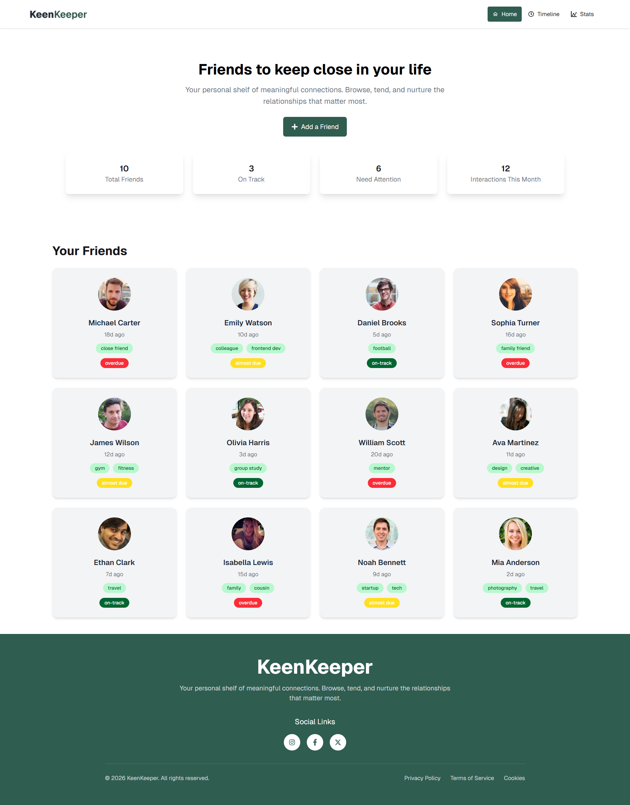
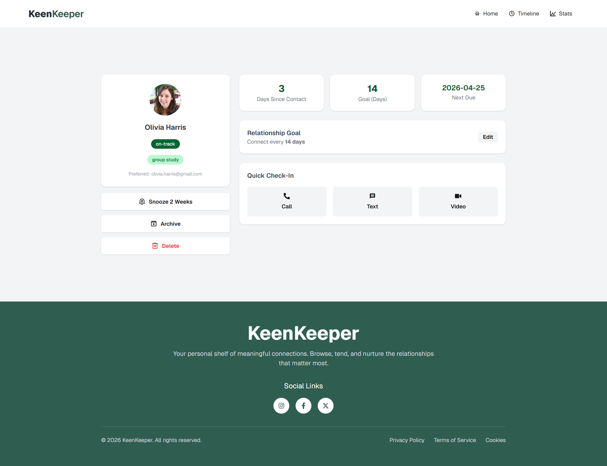
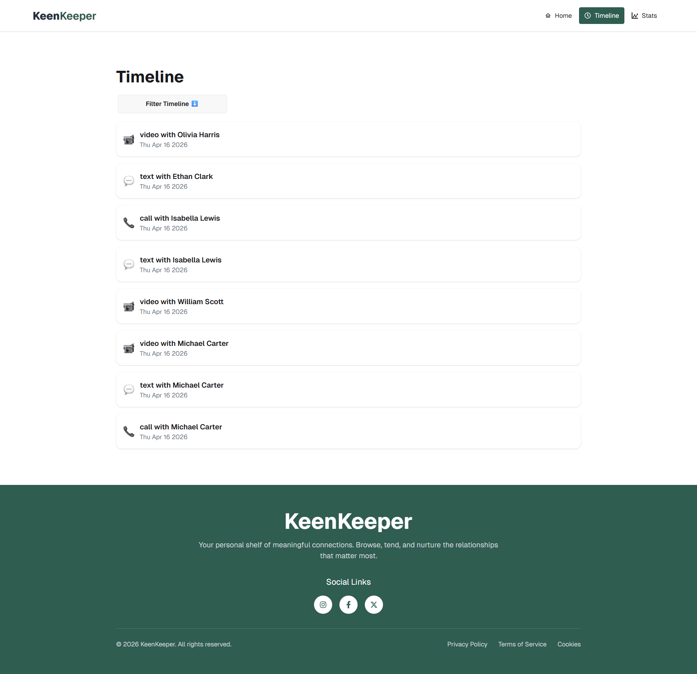
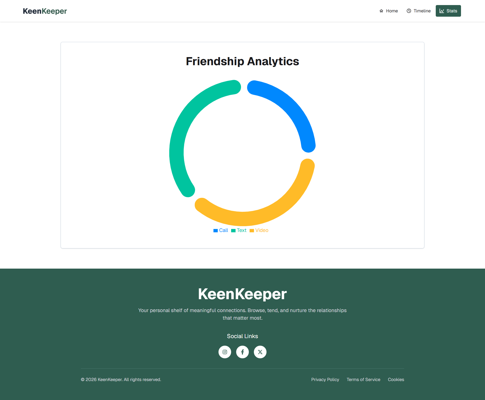

<div align="center">

# 🌿 KeenKeeper

### *Your personal shelf of meaningful connections.*
### Browse, tend, and nurture the relationships that matter most.

<br/>



<br/>

[](https://react.dev/)
[](https://tailwindcss.com/)
[](https://recharts.org/)


</div>

---

## 📖 Table of Contents

- [About The Project](#-about-the-project)
- [Screenshots](#-screenshots)
- [Features](#-features)
- [Tech Stack](#-tech-stack)
- [Getting Started](#-getting-started)
- [Friend Data Schema](#-friend-data-schema)
- [Pages & Routes](#-pages--routes)
- [Responsive Design](#-responsive-design)


---

## 🌱 About The Project

**KeenKeeper — Keep Your Friendships Alive**

KeenKeeper is a relationship-management web application designed to help you maintain meaningful and lasting connections with the people who matter most in your life. It functions as a personal CRM, but instead of managing customers, it helps you nurture friendships.

With KeenKeeper, you can set connection goals for each friend, track when you last reached out, and log interactions such as calls, messages, and video chats. The application also provides a clear overview of your relationship activity over time, helping you stay consistent and intentional in maintaining your social bonds.

By offering gentle reminders and structured tracking, KeenKeeper ensures that important relationships are never unintentionally neglected and continue to grow over time.

---


## 🚀 Live Demo
Check out the live project here:  
[🌐 KeenKeeper Live](https://keen-keeper-a7-project-ph.netlify.app/)

---

## 📸 Screenshots

<details>
<summary><strong>🏠 Home Page — Friends Overview</strong></summary>
<br/>


> The Home page displays all your friends in a responsive 4-column grid. Each card shows the friend's photo, name, days since last contact, tags, and color-coded status (on-track, almost due, overdue).

</details>

<details>
<summary><strong>👤 Friend Details Page</strong></summary>
<br/>



> Clicking any friend card opens their Detail Page. The left column shows their profile info and action buttons; the right column shows contact stats, relationship goal, and a quick check-in panel.

</details>

<details>
<summary><strong>📜 Timeline Page</strong></summary>
<br/>



> The Timeline logs every interaction — calls, texts, and video chats — in reverse chronological order, with filter options for each interaction type.

</details>

<details>
<summary><strong>📊 Friendship Analytics (Stats) Page</strong></summary>
<br/>



> The Stats page shows a Recharts donut chart breaking down your interactions by type (Call / Text / Video), giving you a bird's-eye view of how you communicate.

</details>

---

## ✨ Features

### 🏠 Home Page
- Centered hero section with title, subtitle, and **Add a Friend** button
- Four summary stat cards: Total Friends · On Track · Need Attention · Interactions This Month
- Responsive **4-column grid** of friend cards across all screen sizes 
- Each card shows: photo, name, days since contact, tags, and color-coded status badge
- Click any card to navigate to that friend's Detail Page

### 👤 Friend Details Page
- **Two-column layout**: profile panel (left) + stats & actions (right)
- Left panel: profile picture, name, status badge, tags, bio, email
- Three action buttons: ⏰ Snooze 2 Weeks · 📦 Archive · 🗑️ Delete
- Right panel: Days Since Contact · Goal · Next Due Date stat cards
- Relationship Goal card with **Edit** button
- **Quick Check-In** buttons — Call, Text, Video — each:
  - Logs a new entry to the Timeline with current date & friend's name
  - Triggers a **toast notification** confirming the interaction

### 📜 Timeline Page
- Full interaction history sorted by most recent
- Each entry shows: interaction icon, title (e.g. "Video with Olivia Harris"), and date
- **Filter panel** to filter entries by Call, Text, or Video

### 📊 Stats Page (Friendship Analytics)
- Recharts **donut/pie chart** showing interaction breakdown by type
- Color-coded segments: Call (blue) · Text (green) · Video (yellow)

### 🔧 General
- ⚡ Loading animation while friends data is being fetched
- 🔔 Toast notifications on Check-In button clicks
- 🛣️ **404 page** for unknown/invalid routes
- 🔁 Reload-safe routing (no errors on page refresh after deployment)
- 📱 Fully responsive: mobile · tablet · desktop

---

## 🛠 Tech Stack

| Technology | Purpose |
|---|---|
| **React 18** | UI component model |
| **Tailwind CSS** | Utility-first styling |
| **Daisy/ui** | Accessible UI component library |
| **Recharts** | Pie / donut chart on Stats page |
| **React Toastify** | Toast notifications |
| **React icons** | Icon library |

---

## 🚀 Getting Started

### Prerequisites

Make sure you have the following installed:

- [Node.js](https://nodejs.org/) v18 or higher
- [npm](https://www.npmjs.com/) or [yarn](https://yarnpkg.com/)

### Installation

1. **Clone the repository**

```bash
git clone https://github.com/abutalha08/keen-keeper-A07.git
cd keenkeeper
```

2. **Install dependencies**

```bash
npm install
# or
yarn install
```

3. **Run the development server**

```bash
npm run dev
# or
yarn dev
```

4. **Open your browser**

Navigate to [http://localhost:3000](http://localhost:3000)

### Build for Production

```bash
npm run build
npm run start
```

---

## 🗂 Friend Data Schema

Friends are stored in `public/friends.json`. Each object follows this schema:

```json
{
  "id": 1,
  "name": "Olivia Harris",
  "picture": "https://randomuser.me/api/portraits/women/44.jpg",
  "email": "olivia.harris@gmail.com",
  "days_since_contact": 3,
  "status": "on-track",
  "tags": ["group study"],
  "bio": "Met in university. Study partners turned close friends.",
  "goal": 14,
  "next_due_date": "2026-04-25"
}
```

| Field | Type | Description |
|---|---|---|
| `id` | `number` | Unique identifier |
| `name` | `string` | Friend's full name |
| `picture` | `string` | URL to profile photo |
| `email` | `string` | Preferred email address |
| `days_since_contact` | `number` | Days elapsed since last interaction |
| `status` | `"overdue" \| "almost due" \| "on-track"` | Contact status |
| `tags` | `string[]` | Relationship tags (e.g. "college", "work") |
| `bio` | `string` | Short description of the friendship |
| `goal` | `number` | Target contact frequency in days |
| `next_due_date` | `string` | ISO date string of next scheduled contact |

### Status Color Mapping

| Status | Badge Color |
|---|---|
| `on-track` | 🟢 Green |
| `almost due` | 🟡 Yellow/Amber |
| `overdue` | 🔴 Red |

---

## 🛣 Pages & Routes

| Route | Page | Description |
|---|---|---|
| `/` | Home | Friends grid + summary stats |
| `/friends/[id]` | Friend Details | Individual friend profile & check-in |
| `/timeline` | Timeline | Interaction history with filters |
| `/stats` | Friendship Analytics | Recharts donut chart |
| `*` | 404 | Not Found fallback page |

---

## 📱 Responsive Design

KeenKeeper is fully responsive across all screen sizes:

---

<div align="center">

Made with 💚 by [Abu Talha Taufique](https://github.com/abutalha08)

*KeenKeeper — because great friendships deserve a little tending.*

© 2026 KeenKeeper. All rights reserved.

</div>